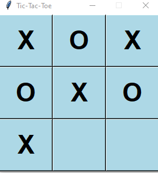

# TicTacToe game 

This is small project for TicTacToe game implementation in python using Tkinter. 

## Description

Tic-tac-toe is a game for two players, cross 'X' and naught 'O', who take turns marking the spaces in a 3×3 grid. Each player occupies a cell in turns and the goal is placing three marks in a horizontal, vertical, or diagonal pattern.  

## Approach 

The code is divided in two parts. Part one contains all the functions and Part 2 the initializations:

 
### PART 1: FUNCTIONS

   *1 - FUNCTION onclick_event => this event is triggered when user clicks a button
        Function to find a button by its name
        Function to set button's value (X or O)
        Function to check game over
   *2 - FUNCTION getting_button_value => Returns button value/text (X or O)
   *3 - FUNCTION checking_game_over  => returns True or False
   *4 - FUNCTION reseting_game => clears all buttons text

###  PART 2: INITIALIZING TIC TAC TOE 
    *1 - Creating and setting window properties
    *2 - Creating font
    *3 - Declaring initial value (X)
 
 
## Demo 

